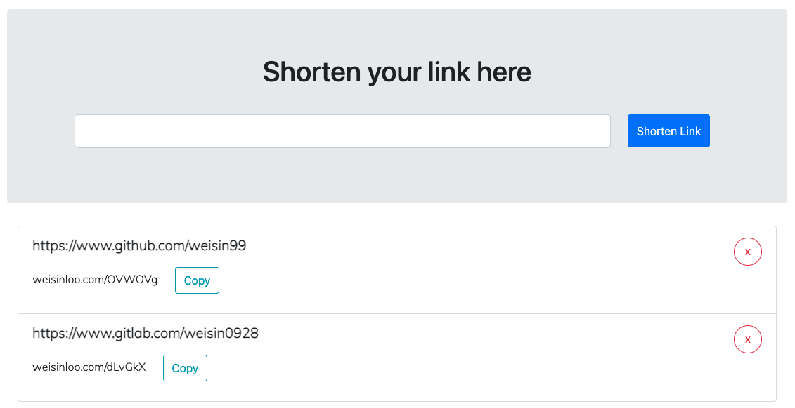

# Link shortener


A web application that can be used to shorten long url.

## Tech Stack

- Backend: Ruby on Rails
- Database: PostgreSQL
- Frontend: HTML, CSS, JavaScript
- Testing: rspec

## System Dependencies

- Git
- Ruby
- NodeJS
- Yarn
- PostgreSQL

## Project Setup

### Setup

```sh
# install gems
bundle install

# install javascript dependencies
yarn install

# create your local database
rails db:create

# run database migration
rails db:migrate
```

### Run development

```sh
# Run a development server on http://localhost:3000/
rails server
```

### Run tests

```sh
# Run ruby test suite
bundle exec rspec
```

